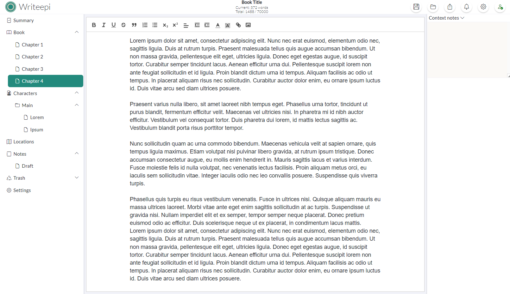

# Writeepi
Main site: https://writeepi.com

Simple, accessible but powerful all-in-one word-processing and organization app for writers

## Story
I needed a simple writing tool that allowed me to save in a format that was easy to manage and secure, with some features for organizing by chapter and scene, managing locations and characters, and taking notes by context.
I've also integrated the ability to build pdf and epub3 files, so that in the future it will be able to easily generate an editor file.

I strayed a little from the original vision of “all cloud” but free for all, then decided to move the application to a desktop version and above all to open source so that it could easily be used offline. What's more, feedback from users will help to produce a quality software more quickly.

The content generated by the application can be very important for its author, so backup management is at the heart of the project.
## Support the project
Writeepi is free and open source, but I don't mind a little “coffee”! If you'd like to support me and contribute to the costs of hosting the site, the forum and the infrastructure needed to develop the project. I'm not giving up hope on the cloud version (which was the first version) and developing a free and secure structure thanks to you!
You can support the project here: https://buymeacoffee.com/writeepi
## Download
Get latest version here : https://github.com/jbm-home/writeepi/releases
### Windows
- Zip file
- Installer
### MacOS
- Zip file
- Dmg installer
### Linux
- Zip file
- Deb installer
## Build
Build instruction from sources
### Frontend / WebUI (Angular)
Prerequisites:
- Install nodejs 22+

Steps:
- Go to 'webui' folder
- run 'npm install'
- run 'npm run buildprod' (or 'npm run build' for debug)
### Desktop container / Electron (nodeJS)
Prerequisites:
- Install nodejs 22+

Steps:
- Go to 'desktop' folder
- run 'npm install'
- run 'npm run make' to build platform executables (built into the desktop/out/ folder)
or
- run 'npm run start' to directly start application for debug
## Contribute
You can help improve Writeepi by [reporting issues](https://github.com/jbm-home/writeepi/issues)