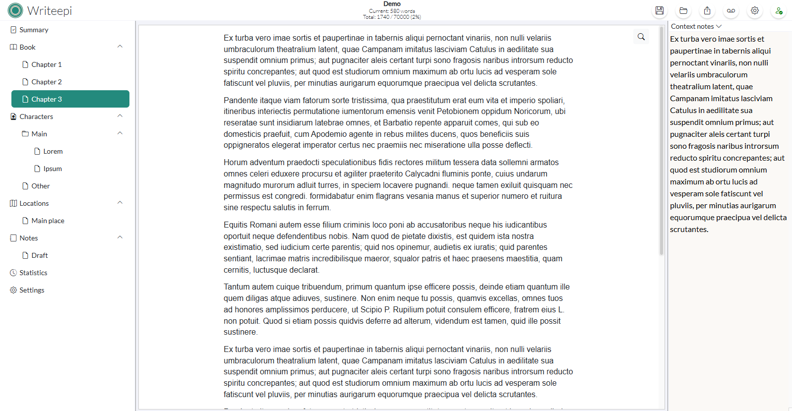

# Writeepi
Main site: https://writeepi.com

Simple, accessible but powerful all-in-one word-processing and organization app for writers

## Story
### Looking for a simple yet powerful writing tool that keeps your work organized and secure?
This project was born from my own need to store writing projects in a safe, easy-to-manage format, with handy features like chapter and scene organization, location and character tracking, and context-based note-taking.

To help you share and preview your work, you can also export to PDF, DOCX or EPUB3, making it easier than ever to create editor-ready files. Although I originally envisioned an "all-cloud" solution, I shifted to a desktop application for full offline control and made it open source so the community could help improve and adapt it quickly.

### Exciting news:
I’ve now restored the cloud version, so you can run your own server and enjoy a more flexible workflow—whether that means collaborating online or simply keeping your writing accessible from anywhere. And because your content is priceless, robust backup management is at the heart of the project.

By gathering user feedback and embracing open-source contributions, this software will continue to evolve, helping authors create with confidence. If you’re looking for a writing tool that’s both convenient and secure, give it a try and help shape its future!
## Support the project
Writeepi is free and open source, but I don't mind a little "coffee"! If you'd like to support me and contribute to the costs of hosting the site, the forum and the infrastructure needed to develop the project. I'm not giving up hope on the cloud version (which was the first version) and developing a free and secure structure thanks to you!
You can buy me a coffee (or two!) right here: buymeacoffee.com/writeepi

Your support goes a long way toward ensuring Writeepi remains a robust, community-driven tool for all writers. Thank you!
## Download
Get latest version here : https://github.com/jbm-home/writeepi/releases
### Windows
- Zip file
- Installer
### MacOS
- Zip file
- Dmg installer
### Linux
- Zip file
- Deb installer
## Build
Build instruction from sources
### Frontend / WebUI (Angular)
Prerequisites:
- Install nodejs 22+

Steps:
- Go to 'webui' folder
- run 'npm install'
- run 'npm run buildprod' (or 'npm run build' for debug)
or
- run 'npm run start' for debug (listen on port 4200 by default)
### Desktop container / Electron (nodeJS)
Prerequisites:
- Install nodejs 22+

Steps:
- Go to 'desktop' folder
- run 'npm install'
- run 'npm run make' to build platform executables (built into the desktop/out/ folder)
or
- run 'npm run start' to directly start application for debug
### Server (nodeJS)
Prerequisites:
- Install nodejs 22+

Steps:
- Go to 'server' folder
- run 'npm install'
- run 'npm run start' (after building webui)
or
- run 'npm run fullbuildandstart' (to build front and start server)
or
- Serve the front ('npm run start' from webui) then 'npm run startdevwin' or 'npm run startdevlinux' depending on your environment

Server is running on port **8337**
### From the root of projects
- "build:webui": Build webui
- "install:webui": Install node modules for webui
- "build:desktop": Build Desktop app
- "install:desktop": Install node modules for desktop app
- "install:server": Install node modules for server
- "build:all": Build webui and desktop
- **"install:all": Install node modules for all projects**
- "start:desktop": Start desktop application
- **"start:desktop:buildfront": Build webui and start desktop app**
- "start:server": Start server
- "start:server:dev:win": Start server in dev mode for windows (run the npm run start of webui before)
- "start:server:dev:linux": Start server in dev mode for linux (run the npm run start of webui before)
- **"start:server:buildfront": Start server after building front**
## Contribute
You can help improve Writeepi by [reporting issues](https://github.com/jbm-home/writeepi/issues)